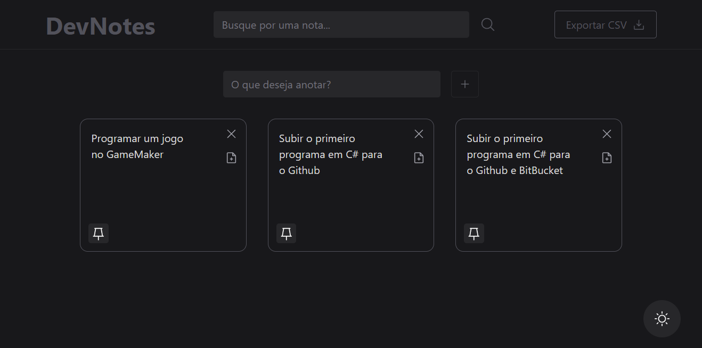

<h1 align="center">DevNotes + React</h1>

Bem-vindo ao meu projeto de Gerenciamento de Notas! Este sistema foi desenvolvido para simplificar a organização das suas notas de forma eficaz. Com ele, você pode facilmente criar, pesquisar, fixar, editar e excluir suas notas, oferecendo uma maneira conveniente e flexível de gerenciar suas informações pessoais.



## Tecnologias
Projeto bem legal, desenvolvido utilizando as seguintes tecnologias:

- ReactJS
- TypeScript
- ViteJS

## Informações Úteis
Para criação do projeto, foi utilizado o Vite.
<!-- - Projeto no ar [aqui](https://devnotes-dusky.vercel.app/) -->

### Pré-requisitos

Certifique-se de que você tenha o Node.js instalado em seu sistema.

### Instalação
Clone o repositório e instale as dependências:

```bash
git clone https://github.com/seu-usuario/devnotes.git
cd devnotes
npm install
npm run dev
```
